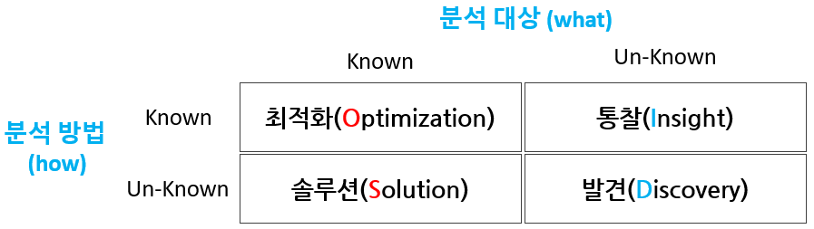
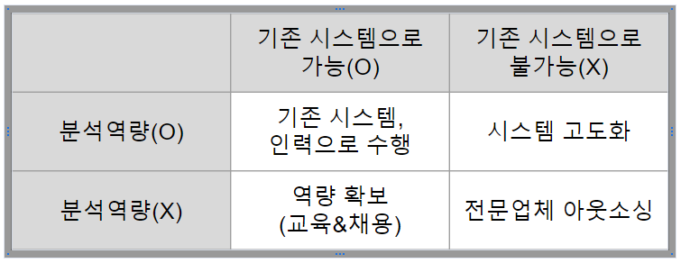
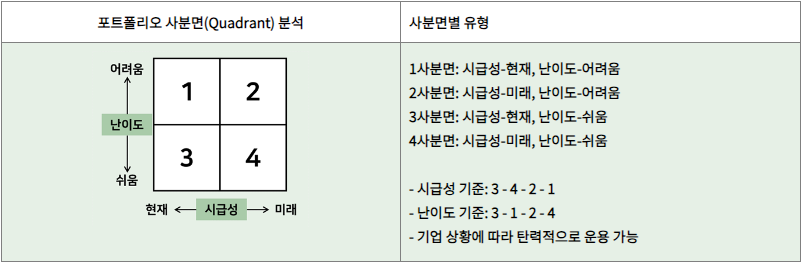

# ADsP 2과목 : 데이터의 분석 기획
## 01 분석의 4가지 유형
*(분석대상을 알면 OS 모르면 ID..ㅎ)*
- 최적화(Optimization) : 분석 대상 및 분석 방법을 이해하고 현 문제를 최적화의 형태로 수행함
- 솔루션(Solution) : 분석 대상 알고, 분석의 방법을 모르는 경우 솔루션을 찾는 방식으로 과제 수행
- 통찰(Insight)
    - 분석의 대상(WHAT)을 모르고 하는 분석 방법(HOW)의 경우 분석 방향
    - 분석 대상을 모르나 기존 분석 방식을 활용해 분석
- 발견(Discovery) : 분석 대상을 모르고, 분석 방법도 모르는 경우 발견을 통해 대상을 새로 선정하는 것

## 02 목표 시점별 분석기획 방안
- 과제 중심적인 접근 방식 (과제 단위)
    - 빠르게 해결하는 것이 목적
    - 빠른 수행, 문제 해결이 목적(Speed & Test)
    - 분석 과제 유형은 Quick & Win
    - 과제 접근 방식은 Problem Solving
- 장기적, 지속적 분석 내재화 (마스터플랜 단위)
    - 지속적 분석 문화 내재화가 목적
    - 정확도, 문제 정의가 목적(Accuracy & Deploy)
    - 분석 과제 유형은 Long term view
    - 과제 접근 방식은 Problem Definition

## 03 분석 기획 시 고려사항
- 가용 데이터(Available Data)
    - 데이터 유형에 대한 분석 - 예) 정형,비정형,반정형 데이터
    - 데이터 확보 가능 여부
- 적절한 활용방안, 유스케이스(Proper Use-Case) 탐색
    - 기존의 유사시나리오 및 솔루션 활용
    - 과거의 유사한 분석사례를 참조
- 장애요소에 대한 사전계획 수립(Low Barrier of Execution)
    - 발생가능한 장애요소에 대한 사전 계획 수립 필요
    - 일회성 분석으로 그치지 않고 조직의 역량을 내재화하기 위해서는 충분하고 계속적인 교육 및 활용방안 등의 변화 관리가 고려되어야 함

## 04 데이터의 종류
- 정형: `CRM Transaction data`, `ERP`, `Demand Forecast`
- 반정형: `sensor`,`machine data`, `competitor pricing`
- 비정형: `Email`, `SNS`, `voice`,`IoT`,`보고서`,`news`

## 05 분석방법론의 구성요소(..절방도템..ㅎ)
- 절차
- 방법
- 도구와 기법
- 템플릿과 산출물

#### 기업의 합리적 의사결정을 방해하는 요소
- 고정관념
- 편향된 생각
- 프레이밍 효과

## 06 분석 방법론의 모델
- 폭포수 모델
    - 단계를 거쳐 순차적 진행
    - 하향식 방향으로 진행
- 프로토타입 모델
    - 사용자 중심 개발 방법
    - 일부 개발 &rarr; 점진적 개선
    - 사용자가 **요구사항이나 데이터를 저확히 규정하기 어렵고 데이터 소스도 명확히 파악하기 어려운 상황**에서 일단 분석을 시도해보고 그 결과를 확인해가면서 반복적으로 개선해 나가는 방법
    - 신속하게 해결책 모형제시, 상향식 접근방법
- **나선형 모델**
    - 반복을 통해 점층적 개발
    - 위험요소 사전 제거에 초점
    - 처음 시도하는 프로젝트에 적용이 용이하지만, 반복에 대한 관리체계를 효과적으로 갖추지 못한 경우 복잡도가 상승하여 프로젝트 진행이 어려울 수 있음.

#### 계층적 프로세스 모델
- 단계 Phase
    - 단계별 산출물 생성
    - 기준선으로 설정 관리
    - 버전 관리 등을 통한 통제 필요
- 태스크 Task
    - 단계를 구성하는 단위 활동
    - 물리적 또는 논리적 단위
    - 품질 검토 항목이 될 수 있음
- 스텝 Step
    - WBS의 워크패키지에 해당함
    - 단위 프로세스
    - 구성: 입력자료-처리 & 도구-출력자료

## 07 KDD 분석
- 통계적 패턴, 지식을 찾기 위해 체계적으로 정리한 데이터마이닝 프로세스
1. 데이터셋 선택
    - 비즈니스 도메인 이해
    - 프로젝트 목표 설정
    - 타겟 데이터 생성
2. 데이터 전처리
    - 전처리: 잡음, 이상치, 결측치 파악 및 제거
    - 의미있는 데이터 재가공
3. 데이터 변환
    - 변수 생성, 선택
    - 데이터의 차원 축소
    - 학습용, 검증용 분리
4. 데이터 마이닝
    - 학습 데이터를 이용
    - 데이터마이닝 기법 선택
    - 적절한 알고리즘 적용
5. 해석 및 결과평가
    - 목적과의 일치성 확인
    - 분석 결과 평가
    - 업무 활용 방안 마련

## 08 CRISP-DM
- 1999, 유럽연합에서 발표한 계층적 프로세스 모델
1. 업무 이해(Business Understanding)
    - 업무 목적 파악
    - 상황 파악
    - 데이터마이닝 목표 설정
    - 프로젝트 계획 수립
2. 데이터 이해
    - **KDD의 데이터 셋 준비 == CRISP-DM의 데이터 이해**
    - 초기 데이터 수집
    - 데이터 기술 분석
    - 탐색, 품질 확인
3. 데이터 준비
    - **KDD의 데이터 전처리, 데이터 변환 == CRISP-DM의 데이터준비**
    - 분석 데이터셋 선택
    - 데이터 정제
    - 편성, 통합, 포맷
4. 모델링
    - 데이터 분석 방법론, 머신러닝을 이용한 수행 모델을 마들거나 데이터를 분할하는 부분(단답형 지문)
    - 모델링 기법 선택, 모델링 작성, 모델 평가
5. 평가(Evaluation)
    - 분석 결과 평가
    - 모델링 과정 평가
    - 모델 적용성 평가
6. 전개
    - 전개 계획 수립
    - 모니터링, 유지보수 계획 수립

## 09 빅데이터 분석 방법론의 계층적 프로세스
1. **분석 기획**
    1. 비즈니스 이해 및 범위 설정
        - SOW(statment of work) 작성 | 작업기술서 또는 업무 기술서
            - SOW를 통해 프로젝트의 목적 달성을 위해서 해야 할 일에 대해 이해할 수 있음
            - 일정,원가,품질에 대한 요구 사항 및 고객, 사용자들을 명시한 포괄적인 문서
            - WBS 범위 기술서에 정의된 high level의 정보를 바탕으로 구체적인 업무 범위를 설정하는 것
    2. 프로젝트 정의 및 계획 수립
        - WBS(work breakdown structure) 작성
    3. 프로젝트 위험 계획 수립
        - 위험에 대한 대응 방법 : **회피(avoid),전이(Transfer),완화(Mitigate),수용(Accept)**
2. 데이터 준비
    - 필요 데이터 정의
    - 데이터 스토어 설계
    - 데이터 수집 및 정합성 점검
3. 데이터 분석
    - 분석용 데이터 준비
    - 텍스트 분석
    - 탐색적 분석
    - 모델링 및 평가, 검증
        > 추가적인 데이터 확보가 필요한 경우 반복적인 피드백을 수행하는 구간
        > 데이터 준비 ~ 데이터 분석
4. 시스템 구현
    - 설계 및 구현
    - 시스템 테스트
    - 시스템 운영
5. 평가 및 전개
    - 모델 발전계획 수립
    - 프로젝트 평가, 보고

## 10 하향식 접근 모델
- 하향식 접근법의 데이터 분석 기획 단계
    - 문제탐색 &rarr; 문제정의 &rarr; 해결방안 탐색 &rarr; 타당성 검토
- 분석 대상이 무엇인지 알고 있음 O
- 최적화 &rarr; 솔루션
- 하향식 접근방식의 **문제 탐색 단계**
    - **비즈니스 모델 기반 문제 탐색** : 비즈니스 모델 틀을 활용하여 가치가 창출될 문제를 누락없이 도출할 수 있다
        > 비즈니스 모델 관점에서는 해당 기업의 사업 모델을 도식화한 비즈니스 모델 캔버스 블록을 단순화하여 **업무, 제품, 고객 단위**로 문제를 발굴하고 이를 관리하는 **지원 인프라, 규제와 감사 영역에 대한 기회를 추가로 도출**하는 작업 수행
    - **분석 기회 발굴의 범위 확장** : 환경과 경쟁구도의 변화, 역량의 재해석을 통해 분석 기회를 추가 도출한다
        > - 거시적 관심의 요인: 사회, 기술, 경제, 환경, 정치 영역
        > - **경쟁자 확대 관점: 대체재 영역, 경쟁자 영역, 신규진입자 영역**
        > - 시장의 니즈 탐색: 고객(소비자)영역, 채널 영역, 영향자들 영역
        > - 역량의 재해석 관점: 내부역량 영역, 파트너 네트워크 영역
    - **외부 참조 모델 기반 문제 탐색**
    - **분석 유스 케이스기반 문제 탐색**
        >현재의 비즈니스 모델 및 유사, 동종사례 탐색을 통해서 빠짐없이 도출한 분석기회들을 구체적인 과제로 만들기 전에 **분석 유즈 케이스**로 표기하는 것이 필요하다. 풀어야 할 문제에 대한 상세서명 및 해당 문제를 해결했을 때 발생하는 효과를 명시함으로써 향후 데이터 분석 문제로의 전환 및 적합성 평가에 분석 유즈 케이스를 활용하도록 한다
- 문제 탐색의 도구
    - 비즈니스 모델 기반 문제 탐색, 외부 참조 모델 기반 문제 탐색, 분석 유즈 케이스
- 해결방안 탐색

    

## 11 상향식 접근 모델
- 포로토타이핑 접근법의 프로세스
    - 가설 생성 &rarr; 디자인에 대한 실험 &rarr; 실제 환경에서의 테스트 &rarr; 테스트 결과에서 인사이트 도출 & 가설 확인
- 디자인 싱킹의 발산 단계에 해당함
- 인사이트 도출 후 반복적인 시행착오를 통해 수정하며 문제를 도출하는 일련의 과정
- 문제의 정의 자체가 어려운 경우 상향식 접근 방식 사용
- 데이터를 기반으로 문제의 재정의 및 해결방안을 탐색하고 이를 지속적으로 개선하는 방식
- 일반적으로 상향식 접근 방식의 데이터 분석은 비지도학습(Unsupervised Learning) 방법에 의해 수행됨.

## 12 디자인 씽킹(Design Thinking)
- 발산(상향식), 수렴(하향식)을 반복적으로 사용하기 쉬움
- 기존의 논리적인 단계별 접근법에 기반한 문제해결 방식은 최근 복잡하고 다양한 환경에서 발생하는 문제에 적합하지 않을 수 있다. 이를 해결하기 위해"디자인 사고" 접근법을 통해 전통적인 분석적 사고를 극복하려고 한다
- 상향식 방식의 발산단계와 도출된 옵션을 분석하고 검증하는 하향식 접근 방식의 수렴단계를 반복하여 과제를 발굴한다.

## 13 분석 과제 관리 프로세스
- 분석 과제 관리 프로세스는 크게 과제발굴과 (과제수행) 및 모니터링으로 나누어진다.
- 과제발굴 단계에서는 개별 조직이나 개인이 도출한 분석 아이디어를 발굴한다
- 분석 과제 확정 후 과제 제안자는 (팀구성)을 하고 (분석과제실행)시 지속적인 모니터링과 과제 결과를 공유하고 개선하는 절차를 수행한다

## 14 분석 프로젝트
- 분석 프로젝트의 특성
    - 분석가의 목표: 정확도↑ 사용자의 원활한 활용
    - 데이터 영역, 비즈니스 영역의 중간에서 조율
    - 도출된 결과 재해석을 통한 지속적인 모델 정교화
    - 모델 개선을 위한 관리 방안 수립 필요함
- 분석과제의 5가지 주요속성을 고려한 관리
    - 데이터 양: 방대하다면 하둡, 클라우드 등을 활용
    - 데이터 속도: 실시간 전달 고려
    - 데이터, 분석 복잡도: 정확도와 복잡도는 트레이드오프 관계
    - 정확도(Accuracy) & 정밀도(Precision)

## 15 분석 마스터 플랜
- 데이터 분석 구현을 위한 적용 우선순위 평가 고려사항
    - 전략적 중요도
    - 실행 용이성
    - 비즈니스 성과/ROI(투자자본수익률)
    
    &rarr; 적용 우선순위 설정
- 적용 범위 및 방식의 고려요소
    - 업무 내재화 적용 수준
    - 분석 데이터 적용 수준
    - 기술 적용 수준

    &rarr; 분석 구현 로드맵 수립
- 중장기적 마스터 플랜 수립을 위해서는 분석 과제를 대상으로 다양한 기준을 고려해 적용할 우선순위를 설정할 필요가 있음
- 분석 과제의 적용 범위 및 방식에 대해서도 종합적으로 고려하여 결정함
- 분석 과제 수행의 선후행 관계를 고려하여 우선순위를 조정해 나간다
- 일반적인 IT 프로젝트의 우선순위로는 전략적 중요도와 실행 용이성이 있다

## 16 분석과제의 우선순위 선정 기법

- 시급성의 판단 기준은 전략적 중요도가 핵심
- 난이도는 현시점에서 과제를 추진하는 것이 비용과 범위 측면에서 쉬운(Easy) 것인지 어려운(Difficulty)것인지에 대한 판단 기준
- 시급성이 높고 난이도가 높은 영역은 경영진 또는 실무 담당자의 의사결정에 따라 적용 우선순위를 조정할 수 있음

## 17 데이터 분석을 위한 조직 구조
- 집중형 조직 구조
    - 조직내에 별도의 독립적인 분석 전담조직이 구성하고 회사의 모든 분석 업무를 전담 조직에서 담당함
    - 일부 협업 부서와 분석 업무가 중복 또는 이원화될 가능성이 있음
- 기능중심 조직 구조
    - 별도로 분석 조직을 구성하지 않고 각 해당 업무부서에서 직접 분석하는 형태임
    - 일반적인 분석 수행구조, 전사적 핵심 분석이 어려움
- 분산 조직구조
    - 조직의 인력들을 협업부서에 배치가 되어 신속한 업무에 적합
    - 전사 차원의 우선순위 수행, 부서 분석업무와 역할 분담 명확히 해야함

## 18 빅데이터 거버넌스의 특징
- 기업이 가진 과거 및 현재의 모든 데이터를 분석하여 비즈니스 인사이트르 찾는 노력은 비용면에서 효율적이지 못함 &rarr; **분석 대상 및 목적을 명확히 정의**하고, 필요한 데이터를 수집,분석하여 점진적으로 확대해 나가는 것이 좋음.
- 빅데이터 분석에서 품질관리도 중요하지만, 데이터 수명주기 관리방안을 수립하지 않으면 데이터 가용성 및 관리 비용 증대 문제에 직면 할 수 있음
- ERD는 운영 중인 데이터베이스와 일치하기 위해 **계속해서 변경사항을 관리**하여야 함
- 산업 분야별, 데이터 유형별, 정보 거버넌스 **요소별로 구분**하여 작성함
- 적합한 분석 업무를 도출하고 가치를 높여줄 수 있도록 분석 조직 및 인력에 대해 **지속적인 교육과 훈련을 실시**함
- 빅데이터 거버넌스와 비교할 때 데이터 거버넌스와의 차이점
    - 데이터 생명주기 관리, 개인정보보호 및 보안, 데이터 품질기준, 변경관리
    - **데이터 백업 주기 변경은 차이점 아님**

> 거버넌스(governance)
> - `공통의 목표를 달성하기 위해 정부, 시민사회, 기업 등 관련 이해관계자가 함께 의사결정을 해나가는 과정`

## 19 분석 성숙도 모델
- 도입 &rarr; 활용 &rarr; 확산 &rarr; 최적화 
- 분석 수준 진단 방법 중 조직의 분석 및 활용을 위한 역량 수준을 파악하기 위해 도입 -> (활용) -> 확산 -> 최적화의 분석 성숙도 단계 포지셔닝을 파악하게 된다

- 분석 수준 진단 결과
    - 확산형 : 높은 준비도, 높은 성숙도
    - 도입형 : 높은 준비도, 낮은 성숙도
    - 정착형 : 낮은 준비도, 높은 성숙도
    - 준비형 : 낮은 준비도, 낮은 성숙도

## 20 데이터 거버넌스
- 구성요소 : 원칙(Principle), 조직(Organization), 프로세스(Process)
- 데이터 거버넌스에서 데이터 저장소 관리
    - 메타데이터 및 표준 데이터를 관리하기 위한 전사 차원의 저장소를 구성함
    - 저장소는 데이터 관리 체계 지원을 위한 워크프로우 및 관리용 응용 소프트웨어를 지원하고 관리 대상 시스템과의 인터페이스를 통한 통제가 이루어져야 함
    - 데이터 구조 변경에 따른 "**사전영향평가**"도 수행되어야 효율적인 활용이 가능함 (단답형)
- 데이터 거버넌스 체계
    - **데이터 표준화 : 데이터 표준용어 설정, 명명규칙 수립, 메타 데이터 구축, 데이터 사전 구축**
    - 데이터 관리체계 : 메타데이터와 데이터 사전의 관리 원칙 수립
    - 데이터 저장소 관리 : 메타데이터 및 표준 데이터를 관리하기 위한 전사 차원의 저장소를 구성
    - 표준화 활동 : 체계 구축 후, 표준 준수 여부를 주기적으로 점검, 모니터링 실시

## 21 데이터 분석 준비도 프레임워크
- 분석 업무 파악에 관한 항목
    - 최적화 분석 업무, 시뮬레이션 분석 업무, 예측 분석 업무
- 분석기법 영역
    - 분석 기법 라이브러리

## 22 분석 거버넌스 체제 고려 사항
- 분석 기획/관리 및 추진 조직
- 분석 프로세스
- 과제 기획/운영 프로세스
- IT 기술과 마인드 육성체계
- 분석 시스템
- 데이터 거버넌스

## 26 관련 용어
- Servitization : 제품과 서비스의 결합을 나타내는 용어
- CoE (Center of Excellence)
    - 구성원들이 비즈니스 역량, IT 역량 및 분석 역량을 고루 갖추어야 하며, 협업부서 및 IT 부서와의 지속적인 커뮤니케이션을 수행하는 조직 내 분석 전문조직을 말함
- 정보전략계획(ISP)
    - 기업의 경영목표 달성에 필요한 전략적 주요 정보를 포착하고, 주요 정보를 지원하기 위해 전사적 관점의 정보 구조를 도축하며, 이를 수행하기 위한 전략 및 실행 계획을 수립하는 전사적인 종합추진 계획
- 프레이밍 효과(Framing Effect)
    - 동일한 사안이라고 해도 제시되는 방법에 따라 그에 관한 해석이나 의사결정이 달라지는 왜곡 현상