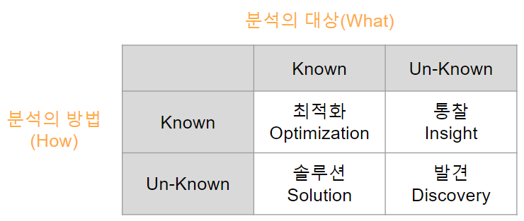

실제 분석을 수행하기에 앞서, 분석을 수행할 <b>과제의 정의</b>에서부터 의도했던 <b>결과를 도출</b>하기 까지의 과정을 적절하게 관리할 수 있도록 방안을 <b>사전에 계획</b>하는 일련의 작업 
분석과제 및 프로젝트를 직접 수행하는 것은 아니지만, 어떠한 목표(What)를 달성하기 위하여(Why) 어떠한 데이터를 가지고 어떤 방식으로(How) 수행할 지에 대한 일련의 계획을 수립하는 작업이기 때문에 성공적인 분석 결과를 도출하기 위한 중요한 사전 작업

분석 기획

분석 대상과 방법에 따라 4가지로 나누어짐

데이터 분석 방법론 구성요소

- 절차(Procedures)
- 방법(Method)
- 도구와 기법(Tools&Techniques)
- 템플릿과 산출물(Templates&Outputs)

KDD 분석 절차

1. 데이터셋 선택
2. 데이터 전처리
3. 데이터 변환
4. 테이터 마이닝
5. 해석 및 결과평가

(KDD 분석) 비즈니스 도메인 이해, 프로젝트 목표 설정, 타겟 데이터 생성

데이터셋 선택

(KDD 분석) 전처리:잡음,이상치,결측치 파악 및 제거, 의미있는 데이터 재가공

데이터 전처리

(KDD 분석)변수 생성,선택, 데이터 차원 축소, 학습용,검증용 분리

데이터 변환

(KDD 분석) 학습 데이터를 이용, 데이터마이닝 기법 선택, 적절한 알고리즘 적용

데이터 마이닝

(KDD 분석)목적과의 일치성 확인, 분석 결과 평가, 업무 활용 방안 마련

해석 및 결과평가

계층적 프로세스 모델로써 4개 레벨로 구성

CRISP-DM 분석 방법론
- 4계층
    1. Phases(단계)
    2. Generic Tasks
    3. Specialized Tasks
    4. Process Instances

빅데이터 분석 방법론 3계층 구성

1. 단계(phase)
2. 태스크(task)
3. 스텝(Step)

분석과제 관리 5가지 주요 영역

- Data Size
- Data Complexity (데이터 복잡도)
- Speed (데이터 주기/속도)
- Analyic complexity(분석 방법론의 복잡도)
- Accuracy & Precision

정보기술 또는 정보시스템을 전략적으로 활용하기 위하여 조직 내,외부환경을 분석하여 기회나 문제점을 도출하고 사용자의 요구사항을 분석하여 시스템 구축/우선순위를 결정하는 등 중장기 마스터 플랜을 수립하는 절차

ISP(Information Strategy Planning)

일반적인 ISP 방법론을 활용하면서 데이터 분석 기획의 특성을 고려하여 수행하고 기업에서 필요한 데이터 분석과제를 빠짐없이 도출한 후 과제의 우선순위를 결정하고 단기 및 중 장기로 나누어 계획을 수립 함

분석 마스터 플랜

분석 거버넌스 체계 5가지

1. 분석관련시스템(System)
2. 데이터(data)
3. 분석교육/마인드 육성체계(Human Resource)
4. 분석기획 및 관리 수행 조직(Organization)
5. 과제 기획 및 운영 프로세스(Process)

전사 차원의 모든 데이터에 대하여 정책 및 지침, 표준화, 운영조직 및 책임 등의 표준화된 관리 체계를 수립하고 운영을 위한 프레임워크 및 저장소를 구축하는 것.

데이터 거버넌스

